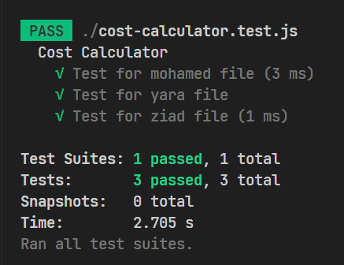

# Calculate the cost of an employee

## The problem is defined as follows:

You are a manager of a company and you want to calculate the cost of an employee per hour. The cost of an employee per hour is calculated by dividing the salary by the number of hours worked per month.

Now you have some employees files each represented as [employee-name].json and you want to write a Node.js program to calculate the cost of each employee per hour. The program should read the employee's file and print the cost of the employee per hour in the terminal or command prompt.

### Instructions:

-   You have a file named `mohamed.json`

```json
{
	"name": "mohamed",
	"hours": 160,
	"salary": 10000
}
```

-   Another file named `cost-calculator.js` in your project directory, write in this file the code to read and process the JSON file.
-   Your function should return object containing the name of the employee and the cost per hour.

```js
{
    name: "Mohamed",
    cost: 62.5
}
```

-   You can use the `index.js` file in this directory to test your code before heading to the next step.

## How to test your code?

-   First thing install the dependencies by running `npm install` in the terminal.
-   Run `npm run test` to test your code. `Set-ExecutionPolicy RemoteSigned`
-   If you get anything like this then you are good to go. <br> 
-   Any red marks means that you have to fix your code.
